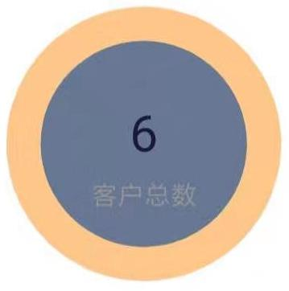
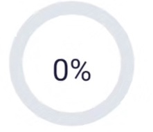
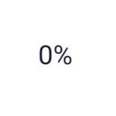

## 简介  
本项目是 ECharts 的微信小程序版本，以及使用的示例。  
  
该项目对[ecomfe/echarts-for-weixin](https://github.com/ecomfe/echarts-for-weixin)做了少量改动来兼容uni-app     
  
需要通过uni-app编译后使用     
  
如果你需要使用原生小程序开发方式，请移步[ecomfe/echarts-for-weixin](https://github.com/ecomfe/echarts-for-weixin)    
  
开发者可以通过熟悉的 ECharts 配置方式，快速开发图表，满足各种可视化需求。    

## 文件目录结构  

为了兼容小程序 Canvas，我们提供了一个小程序的组件，用这种方式可以方便地使用 ECharts。

其中，`uni-ec-canvas` 是我们提供的组件，其他文件是如何使用该组件的示例。  

lazy-load为懒加载示例    

multi-charts为一个页面中多个表格的示例    

其余示例请移步[官方示例](https://www.echartsjs.com/examples/zh/index.html)   

然后将option替换即可  

`uni-ec-canvas` 目录下有一个 `echarts.js`，默认是包含所有功能的echarts。如有可以，建议从[官网自定义构建](http://echarts.baidu.com/builder.html)来替换这个文件以减小文件大小。  

## 使用  
复制uni-ec-canvas至你公用的组件文件夹   
在页面中引入  

```html 
<template>
    <view>
       <uni-ec-canvas 
          class="uni-ec-canvas"
          id="uni-ec-canvas"
          ref="uni-ec-canvas"
          canvas-id="uni-ec-canvas"
          :ec="ec"
       ></uni-ec-canvas>
    </view>
</template>
```
```js 
<script>
// 此处将路径替换为你放置该组件的路径  
import uniEcCanvas from './uni-ec-canvas/ec-canvas.vue'  

export default{
    data(){
        return {
            ec:{
                options:{} //echart 配置项
            }
        }
    },
    components:{
        uniEcCanvas
    }
}
</script>
```
```css
// 这里一定要注意 设置该组件宽高 以及display:block来确保canvas初始化的时候是有宽高的
<style>
.uni-ec-canvas{
    width:100%;
    height:100%;
    display:block;
}
</style>
```

## FAQ
### uni-app 编译卡死  
如果你配置了eslint检查，请屏蔽对echart.js的检查，否则会卡死

### 如何改变数据  
改变ec.option中的值图表即可动态变化  注意新增属性请使用$set

### 如何获取图表实例？

在页面中使用 this.$refs['uni-ec-canvas'].$curChart即可获取chart实例

### 如何延迟加载图表？

参见 `examples/lazyLoad` 的例子，可以在获取数据后再初始化数据。

### 如何在一个页面中加载多个图表？

参见 `examples/multiCharts` 的例子。

### 文件太大怎么办？

本项目默认提供的 ECharts 文件是最新版本的包含所有组件文件，为了便于开发，提供的是未压缩的版本。远程调试或预览可以下载 [echarts.min.js](https://github.com/apache/incubator-echarts/blob/master/dist/echarts.min.js) 压缩版本。

发布时，如果对文件大小要求更高，可以在 [ECharts 在线定制](http://echarts.baidu.com/builder.html)网页下载仅包含必要组件的包，并且选择压缩。

下载的文件放在 `uni-ec-canvas/echarts.js`，**注意一定需要重命名为 `echarts.js`**。

## 微信版本要求
支持微信版本 >= 6.6.3，对应基础库版本 >= 1.9.91。尽可能使用更高版本的基础库版本。
### Canvas 2d 版本要求
最新版的 ECharts 微信小程序支持微信 Canvas 2d，当用户的基础库版本 >= 2.9.0 且没有设置 force-use-old-canvas="true" 的情况下，使用新的 Canvas 2d（默认）。

使用新的 Canvas 2d 可以提升渲染性能，解决非同层渲染问题，强烈建议开启

如果仍需使用旧版 Canvas，使用方法如下：
```
<ec-canvas id="xxx" canvas-id="xxx" ec="{{ ec }}" force-use-old-canvas="true"></ec-canvas>
```


调试的时候，需要在微信开发者工具中，将“详情”下的“调试基础库”设为 1.9.91 及以上版本。

发布前，需要在 [https://mp.weixin.qq.com](https://mp.weixin.qq.com) 的“设置”页面，将“基础库最低版本设置”设为 1.9.91。当用户微信版本过低的时候，会提示用户更新。

## 暂不支持的功能

ECharts 中的绝大部分功能都支持小程序版本，因此这里仅说明不支持的功能，以及存在的问题。

以下功能尚不支持，如果有相关需求请在echarts-for-weixin的 [issue](https://github.com/ecomfe/echarts-for-weixin/issues) 中反馈，对于反馈人数多的需求将优先支持：

- 图片
- 多个 zlevel 分层

此外，目前还有一些 bug 尚未修复，部分需要小程序团队配合上线支持，但不影响基本的使用。已知的 bug 包括：

- 安卓平台：transform 的问题（会影响关系图边两端的标记位置、旭日图文字位置等）
- iOS 平台：半透明略有变深的问题
- iOS 平台：渐变色出现在定义区域之外的地方

## issue 

如本项目有问题，欢迎在[issue](https://github.com/yah0130/echarts-wx-uniapp/issues) 中向我们反馈，谢谢！

## 常见问题及解决方案
以图形分类

### 所有图  
1. 图表会覆盖弹窗，tab等页面组件上面  
原因: 微信小程序中 canvas为原生组件，拥有最高优先级。  
解决方案： 弹窗等需要覆盖图表的组件使用cover-view,cover-image来实现 详情请查看[小程序原生组件限制](https://developers.weixin.qq.com/miniprogram/dev/component/native-component.html#%E5%8E%9F%E7%94%9F%E7%BB%84%E4%BB%B6%E7%9A%84%E4%BD%BF%E7%94%A8%E9%99%90%E5%88%B6)  

2. tooltip在手机上超出的部分不会显示   
原因： echart自身问题  
解决方案：需要通过判断点击的位置来动态设置tooltip的position  

3. 格式化需要传入function无效
原因： 被序列化掉了
解决方案：需要手动setOption，例子如下：

```html
<template>
  <view>
    <uni-ec-canvas class="uni-ec-canvas" id="line-chart" ref="canvas" canvas-id="lazy-load-chart" :ec="ec"></uni-ec-canvas>
  </view>
</template>

<script>
  import uniEcCanvas from '@/components/uni-ec-canvas/uni-ec-canvas'
  import * as echarts from '@/components/uni-ec-canvas/echarts'
  let chart = null
  export default {
    data() {
      return {
        ec: {
          lazyLoad: true
        },
        option: {
          title: {
            text: ''
          },
          tooltip: {
            trigger: 'axis',
            formatter: '{b}\r\n{c0}人',
            axisPointer: {
              type: 'line',
              axis: 'x',
              label: {
                backgroundColor: '#000000'
              }
            }
          },
          grid: {
            left: '6%',
            right: '6%',
            top: '6%',
            bottom: '6%',
            containLabel: true
          },
          xAxis: {
            type: 'category',
            boundaryGap: false,
            data: ['2-12', '2-14', '2-16', '2-18', '2-20', '2-22', '2-24'],
            axisLine: {
              // y轴
              show: false
            },
            axisTick: {
              // y轴刻度线
              show: false
            },
            splitLine: {
              // 网格线
              show: false
            }
          },
          yAxis: {
            type: 'value',
            axisLine: {
              // y轴
              show: false
            },
            axisTick: {
              // y轴刻度线
              show: false
            },
            splitLine: {
              // 网格线
              show: false
            }
          },
          series: [{
            name: '浏览量',
            type: 'line',
            smooth: true,
            lineStyle: {
              color: '#EF5959'
            },
            data: [120, 132, 101, 134, 90, 230, 210]
          }]
        }
      };
    },
    methods: {
      initChart(canvas, width, height, canvasDpr) {
        console.log(canvas, width, height, canvasDpr)
        chart = echarts.init(canvas, null, {
          width: width,
          height: height,
          devicePixelRatio: canvasDpr
        })
        canvas.setChart(chart)
        chart.setOption(this.option)
        return chart
      },
    },
    onUnload() {
      chart = null
    },
    onLoad() {
      this.$refs.canvas.init(this.initChart)
    }
  }
</script>

<style scoped>
  .uni-ec-canvas {
    width: 100%;
    height: 100vh; 
    display: block;
  }
</style>
```


### 饼状图  
1. 饼装图在安卓机下颜色中间会有颜色填充 如下图所示  
   
原因: echart自身bug，一直没有修复。当饼状图最后一个数据为0时，会已最后一个数据的颜色填充中间。    
解决方案:  
1.最后一个数据如果为0，强制设置为0.00001   
2.添加一个假数据,颜色设置为中间的颜色，但是这个数据不显示。数据如下(中间填充白色)   
``` json
{ 
    value: 0, 
    name: '', 
    itemStyle: { color: '#ffffff' },
     label: { show: false }, 
     emphasis: { label: { show: false } } 
}
```

2. 饼状图禁用点击高亮(**hoverAnimation:false**)后标签和标签线虽然不显示了，但是高亮颜色还是会变化   
如下图所示:图1未点击，图2点击过后   
  
 

解决方案：  
1.通过设置ec.stopTouchEvent来禁用点击事件，来放置用户点击    
2.通过设置高亮颜色和不高亮颜色一致来使得看起来没有变化   